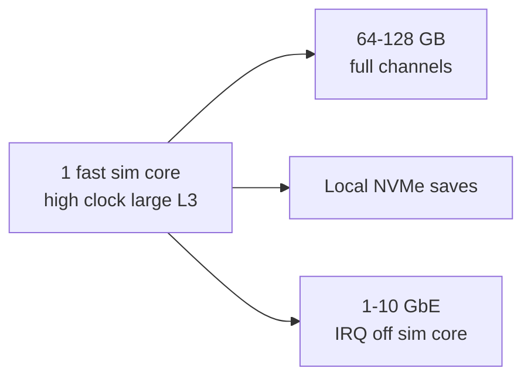

# Dedicated server host tuning (CCD, NUMA, ops)

**Hub:** [`README.md`](../README.md).  
**Audience:** Linux hosts running `7DaysToDieServer` under load.  
**Owns:** CCD/NUMA/affinity/IRQ/storage host placement (ops).  
**Not:** in-process Harmony optim ([FEATURES](FEATURES.md)), game sim map ([ARCHITECTURE](ARCHITECTURE.md)), RealEarth product status.  
**Companion docs:** [`ARCHITECTURE.md`](ARCHITECTURE.md) (sim hot path), [`DEVELOPMENT.md`](DEVELOPMENT.md) (EfficientServer), sibling `7dtd-apm` (evidence), workspace [`MODDING_BEST_PRACTICES.md`](../../MODDING_BEST_PRACTICES.md).  
**Engine loop / scale evidence:** [`../../7dtd-research/docs/loop.md`](../../7dtd-research/docs/loop.md), [`measured-scaling.md`](measured-scaling.md) (APM laws live in this repo, not research).  
**Stock ceilings:** [`../../7dtd-research/docs/engine-limitations.md`](../../7dtd-research/docs/engine-limitations.md).

EfficientServer only changes **in-process** behavior via Harmony. Much of dedicated performance is **outside** the game DLL: stock config, workload shape, storage, and CPU topology. This document is the measure-first checklist for host and process placement.

**Do not** bake CCD/NUMA pinning into EfficientServer. Topology is machine-specific; pin with systemd/`taskset`/cgroups and validate with APM.

---

## 1. Optimization layers (expected impact)

Typical order for a Unity/Mono dedicated with a **single-thread-dominated sim loop** (see ARCHITECTURE: extra cores help secondary threads only):

| Priority | Layer | Examples | Owner in this workspace |
|---|---|---|---|
| 1 | Game data / stock knobs | `MaxSpawnedZombies`, view distance, `DynamicMesh*`, `SandboxCode`, world size | `serverconfig.xml` / ops |
| 2 | Workload shape | Player count/spread, blood moon, POI density | `7dtd-loadgen` + world choice |
| 3 | Sim / Harmony | EfficientServer AI LOD, dedicated skips, mesh budgets; avoid heavy inject mods | `7dtd-optimizer`, other mods |
| 4 | Runtime noise | Mono GC spikes, competing processes on the host | `7dtd-apm` + process hygiene |
| 5 | **CPU topology** | CCD affinity, core isolation, NUMA bind, IRQ steering | **This doc** (host ops) |
| 6 | Storage / net | Local SSD for userdata, avoid high-latency NFS for saves, sane NIC settings | Host ops |

CCD/NUMA work is real, but it mostly buys **lower jitter and protecting the main sim core**, not free zombie capacity. If the main thread is already idle under your load shape, topology tuning is noise.

---

## 2. Why topology matters for this process

```text
7DaysToDieServer.x86_64
  └─ Unity player loop + Mono
       ├─ Main / gmUpdate path     ← sim budget lives here (hot, latency-sensitive)
       ├─ Pathfinding / workers    ← can use other cores
       ├─ Mesh / async helpers     ← secondary
       └─ LiteNetLib I/O           ← secondary
```

- **Single-thread main loop:** more sockets do not parallelize `gmUpdate`.
- **Cross-CCD (AMD chiplet) hops:** remote L3 costs show up as **frame-time variance** when the hot thread and its data bounce between dies.
- **Classic NUMA (multi-socket):** wrong node placement adds memory latency for the whole process.
- **IRQ / softirq on the sim core:** NIC or disk interrupts steal the main thread under player load.

Measure thread CPU and run-queue latency with `7dtd-apm` (thread collector, sched/futex, perf) before pinning.

### MEASURED: naive main-thread pinning HURTS on Ryzen 9950X (2026-07-20)

A/B on a Ryzen 9950X (16C/32T, single NUMA, `run_server.sh SEVENDTD_CPU_AFFINITY`):
main sim thread (tid==pid) pinned alone to physical core 0 (SMT sibling 16 idle),
all other threads on 1-15,17-31. Verified: core 0 100% busy, core 16 idle. **Result:
worse** - UpdateTick p95 21.9 -> 27.7 ms, **jitter (p95-avg) 2.1 -> 4.6 ms (+122%)**
(jitter is load-independent; the ms_per_tick delta was partly confounded by unequal
zombie counts). Sessions `session_20260720_025648` (default) / `_030426` (isolated).

**Why:** the 9950X has aggressive per-core boost + **AMD CPPC "preferred core"**
placement. The default scheduler runs the hot thread on the best-boosting preferred
core and migrates as needed; **a fixed pin overrides that** (core 0 is not necessarily
the preferred core) and scatters workers across both CCDs, adding cross-CCD latency
for main<->worker data. **The OS scheduler beats naive pinning on modern boost-heavy
CPUs.** Do NOT pin the sim thread to an arbitrary core.

**If you still pin,** do it right: pin to the **CPPC preferred core** (read
`/sys/devices/system/cpu/cpu*/acpi_cppc/highest_perf`, pick the max), keep the whole
process on **one CCD** (`0-7,16-23`) for L3 locality rather than isolating one core,
and move IRQs off the sim core. Untested here; the safe default is **no pinning**.

---

## 3. Measure-first gate (required)

Run the **same** loadgen manifest before and after any host change.

### When host topology is worth trying

All of the following should be true (or strongly suspected from APM):

1. Stock knobs and obvious sim load are already reasonable (not 128 view distance + max zombies for fun).
2. APM shows **sustained high CPU on one or a few game threads**, not pure disk wait.
3. Sched samples show **runnable wait / migration / noisy neighbors** (or you co-locate other heavy jobs on the host).
4. You can name the **physical package / CCD / NUMA node** layout (`lscpu`, `numactl -H`).

### When to skip topology work

- Main thread is not hot; APM points at AI counts, mesh, or disk.
- Single quiet core on a small CPU with no other services.
- You cannot hold loadgen constant (no fair A/B).

### Evidence checklist

| Signal | Tooling |
|---|---|
| Managed tick / `gmUpdate` time | APM bridge |
| Per-thread CPU | APM threads / `perf` / host profiler |
| Run-queue / off-CPU | APM sched / bpftrace collectors |
| GC pauses | APM bridge GC samples |
| Disk latency | APM block/vfs collectors |
| Before/after validity | Same duration, collectors, workload manifest |

Acceptance: lower p99 frame or tick time under the **same** load, or clearer headroom on the sim core, without gameplay regressions if you also changed mods. Topology-only changes should not change sim fidelity; still smoke multiplayer.

---

## 4. Inventory the machine

```bash
lscpu
lscpu -e=CPU,CORE,SOCKET,NODE,CACHE  # layout sketch
numactl -H                           # NUMA nodes (empty-ish on UMA)
cat /sys/devices/system/cpu/cpu0/topology/thread_siblings_list
# AMD CCD-ish: group by L3 if available
ls /sys/devices/system/cpu/cpu*/cache/index*/shared_cpu_list 2>/dev/null | head
```

Record:

| Fact | Example use |
|---|---|
| Sockets | Multi-socket → NUMA bind matters |
| Cores per CCD / L3 domain | Pin main thread inside one L3 |
| SMT siblings | Prefer physical cores for the sim thread if you isolate |
| NUMA nodes + memory | `numactl --cpunodebind=N --membind=N` |
| Other tenants | Isolate or move noisy services |

---

## 5. Techniques (what / when / how)

### 5.1 Process CPU affinity (first topology lever)

**When:** One package, multi-CCD, main thread hot; keep the server on a contiguous set of cores that share L3 when possible.

**How (examples, adjust IDs to your map):**

```bash
# Temporary (current shell)
taskset -c 0-7 ./7DaysToDieServer.x86_64 ...

# Or bind after start
taskset -cp 0-7 "$SERVER_PID"
```

systemd unit fragment:

```ini
[Service]
CPUAffinity=0-7
# Optional: prefer performance
# CPUAccounting=yes
```

**Validate:** APM thread map still makes sense; tick p99 improves or variance drops.

### 5.2 CCD-aware placement (AMD chiplets)

**When:** Zen-family multi-CCD CPU; cross-CCD traffic suspected.

**Practice:**

1. Identify which logical CPUs share an L3 / CCD.
2. Place the **server process** primarily on **one CCD’s cores** (or one CCD + a neighbor only if you need more workers).
3. Prefer not to straddle two far CCDs for the whole process “just to use all cores.”
4. Leave other CCDs for OS, DB, or second services if co-hosted.

There is no universal “CCD 0 is best.” Pick a CCD, pin, measure, compare to unpinned baseline.

### 5.3 Classic NUMA bind (multi-socket)

**When:** `numactl -H` shows multiple nodes with separate memory.

```bash
numactl --cpunodebind=0 --membind=0 \
  ./7DaysToDieServer.x86_64 -quit -batchmode -nographics -dedicated -configfile=serverconfig.xml
```

**Avoid:** Binding CPUs to node 0 and memory to node 1.  
**Avoid:** On single-node UMA boxes, cargo-cult `numactl` with no effect.

### 5.4 Core isolation (`isolcpus` / cpuset / cgroup)

**When:** Dedicated game host, you want a quiet core for the main thread; sched noise shows up under load.

**Practice (high level):**

1. Reserve 1-2 physical cores (and their SMT siblings) via kernel isolcpus **or** cgroup cpuset exclusive set.
2. Pin **only** the game process (or only after you know the main TID) onto that set.
3. Keep IRQs off those cores (next section).

Isolation is **ops-heavy** (reboot/kernel cmdline or careful cgroup). Do it after simple `CPUAffinity` already helps.

### 5.5 IRQ and softirq steering

**When:** High PPS multiplayer; `perf` / softirq time lands on the same core as the sim thread.

```bash
# Inspect (example)
grep . /proc/interrupts | head
# Per-IRQ smp_affinity_list under /proc/irq/*/smp_affinity_list
```

Move NIC (and busy disk) IRQs **away** from the isolated/sim cores. Exact names depend on the NIC driver. Re-check after reboot (irqbalance may undo settings unless configured).

### 5.6 CPU governor and idle states

**When:** Latency spikes with low average CPU; cores deep-idle then wake for ticks.

```bash
# Inspect
cat /sys/devices/system/cpu/cpu0/cpufreq/scaling_governor
```

**Options (host policy, not game config):**

- `performance` governor on the package used by the server  
- Limit deepest C-states on the sim cores (vendor-specific; document what you set)

Tradeoff: power and heat. Measure p99, not only averages.

### 5.7 Process priority

**When:** Co-located with batch jobs that steal CPU.

```bash
nice -n -5 ...    # modest; root/capabilities may be required for negative nice
# or systemd: Nice=-5
```

**Avoid:** Realtime priorities (`chrt -f`) unless you know the failure modes (can starve the machine). Prefer isolation + affinity first.

### 5.8 Storage and userdata

**When:** APM shows block/VFS latency correlated with hitches; large saves; networked filesystem.

| Prefer | Avoid |
|---|---|
| Local NVMe/SSD for `UserDataFolder` / saves / GeneratedWorlds | Saves on high-latency NFS without testing |
| Explicit `UserDataFolder` on the fast volume | Silent default on a full or remote disk |
| Enough free space / no thrashing | Logging and backups on the same contended spindle as the only disk |

Topology does not fix slow region I/O.

### 5.9 Network (secondary)

LiteNetLib path; stock can disable SteamNetworking via `ServerDisabledNetworkProtocols`. Host side:

- Enough `ServerMaxPlayerCount` headroom without oversubscription experiments  
- NIC on a quiet IRQ set (above)  
- Do not chase micro-tuning ethtool until sim and disk are clean  

Loadgen and fake clients need **EAC off** for the bot protocol path; that is a test constraint, not a production EAC policy.

---

## 6. Ideal hardware shape (for this process)

`gmUpdate` is **single-thread dominated**. Ideal host design is not “max cores.”



| Component | Prefer | Why |
|---|---|---|
| **CPU** | High IPC + high clocks; pin process to **one CCD / one L3** | Main loop does not scale across sockets/CCDs |
| **Cores** | 8-16 useful cores; leave free cores for OS/IRQ | Workers/path/mesh secondary only |
| **RAM** | **64 GB** typical public; **128 GB** dense AI / RealEarth expand | Mono GC + chunk/tile residency |
| **DIMMs** | Full channel population; stable fast profile | Alloc/GC and bulk chunk traffic are bandwidth-sensitive |
| **Disk** | Local NVMe for UserData / regions / tile cache | Save and stream hitches track disk latency |
| **NIC** | Clean path; IRQs off sim core | Player-axis cost is CPU in ConnectionManager / NetEntity more than raw Gbps |
| **GPU** | None required for headless dedi | `-batchmode -nographics` |

**Measured software walls still dominate:** player-axis net ~O(N²) (cliff near high hundreds of bots in loadgen), entity AI ~O(N). Hardware delays the cliff; EfficientServer + stock knobs still required.

**Anti-spend:** dual-socket “for more TPS,” huge GPU, max core count at low clocks, NFS for live saves.

Tiers:

| Tier | Rough shape |
|---|---|
| Friends (8-16) | Fast 6-8 cores, 32 GB, NVMe |
| Public mid (32-64) | High-clock 8-12 cores, 64 GB, pinned cpuset, NVMe |
| Hard case (high players / dense AI / RealEarth) | One CCD high-clock, 128 GB multi-channel, NVMe, quiet host |

---

## 7. Suggested A/B procedure

```text
1. Record machine map (lscpu / numactl)
2. Baseline: loadgen + 7dtd-apm (standard or deep), fixed world/seed/bots/duration
3. Apply ONE host change (e.g. CPUAffinity to one CCD)
4. Repeat identical scenario
5. Compare tick/CPU/sched; keep only if variance or headroom improves
6. Only then try isolation / IRQ / governor
```

Document the final affinity mask and kernel cmdline in the server’s ops notes so a reboot does not silently lose the win.

---

## 8. What not to do

| Anti-pattern | Prefer |
|---|---|
| Pin inside EfficientServer C# | systemd / taskset / numactl |
| Use all cores “for fairness” across every CCD | Keep hot process on one L3 domain when main-thread bound |
| NUMA bind without multi-node hardware | Skip |
| Topology before reducing MaxSpawnedZombies / view distance | Layer 1 knobs first |
| Claim a win without same loadgen + APM compare | Invalid evidence |
| Realtime RR/FIFO on the whole server | Affinity + isolation first |
| Commit game IL or machine-specific masks into the mod repo as required config | Ops docs next to the unit file |

---

## 9. Relationship to EfficientServer and APM

| Question | Answer |
|---|---|
| Does EfficientServer set affinity? | **No.** Out of scope. |
| Does APM set affinity? | **No.** It only measures (optional bridge for managed timings). |
| Can host tuning replace EfficientServer? | **No.** Different layers; both can apply. |
| Can host tuning replace stock caps? | **No.** Sim work still scales with zombies/chunks. |
| Where do I prove a host change? | `7dtd-apm` session compare under `7dtd-loadgen`. |

---

## 10. Quick decision tree

```text
Is MaxSpawnedZombies / view distance / mesh / SandboxCode sane?
  No  → fix serverconfig first
  Yes → Is the main sim thread hot under APM?
          No  → chase disk, GC, or sim content (mods, world), not CCD
          Yes → Is the host multi-CCD or multi-socket?
                  No  → governor / isolation / kill noisy neighbors
                  Yes → pin process to one L3/NUMA node → re-measure
                        still noisy? → IRQ off sim cores, then isolcpus/cpuset
```

---

## Related docs

| Doc | Role |
|---|---|
| [OPTIMIZATION_CANDIDATES](OPTIMIZATION_CANDIDATES.md) | Graded candidate backlog |
| [OPTIMIZATION_IDEAS](OPTIMIZATION_IDEAS.md) | Idea map |
| [SIM_PARALLELISM](SIM_PARALLELISM.md) | Sim threading / extract-off-main |
| [ARCHITECTURE](ARCHITECTURE.md) | Single-thread sim hot path |
| [FEATURES](FEATURES.md) | EfficientServer feature groups |
| [SCALE_1000x10000](SCALE_1000x10000.md) | Extreme scale design notes |
| [research loop](../../7dtd-research/docs/loop.md) | gmUpdate / dedicated frame |
| [measured-scaling](measured-scaling.md) | Live player/entity scaling laws |
| [runtime-tuning](runtime-tuning.md) | GC / FPS process knobs |
| APM | [`../../7dtd-apm/docs/APM.md`](../../7dtd-apm/docs/APM.md) |
| Loadgen | [`../../7dtd-loadgen/docs/README.md`](../../7dtd-loadgen/docs/README.md) |

## Changelog

- **2026-07-18:** Ideal hardware §6; ownership header; related docs to research scale/loop.
- **2026-07-16:** Initial host tuning guide (layers, measure-first gate, CCD/NUMA/affinity/IRQ/storage, A/B procedure). Grounded in ARCHITECTURE single-thread sim note and workspace APM/loadgen/optimizer boundaries.
