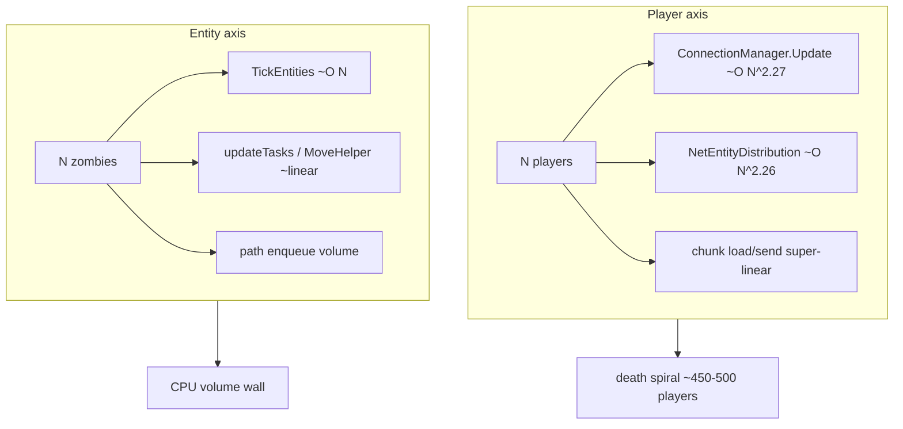

# Measured scaling & runtime behavior (V 3.0.1 dedicated)

**Owns:** live APM scaling measurements (complement to static IL map).  
**Not:** host CCD/NUMA ops ([HOST_TUNING](HOST_TUNING.md)), product RealEarth status.  
**Loop/net context:** [`loop.md`](../../7dtd-research/docs/loop.md), [`network.md`](../../7dtd-research/docs/network.md).  
**Ceiling map (static):** [`engine-limitations.md`](../../7dtd-research/docs/engine-limitations.md).  
**Hub:** [`INDEX.md`](../../7dtd-research/docs/INDEX.md).

Empirical complement to the static IL map ([`loop.md`](../../7dtd-research/docs/loop.md), [`network.md`](../../7dtd-research/docs/network.md)).  
IL surfaces named below are documented under `research/il/gaps-v3.1.0/`, `research/il/loop-complete-v3.1.0/` (historical `gmUpdate-v3.0.1` name), `research/il/dedi-complete-v3.1.0/` (e.g. `ConnectionManager.Update` IL≈215, `NetEntityDistribution.OnUpdateEntities` IL=322).  
All numbers from live `7dtd-apm` captures against the V3.0.1 dedicated server with the Harmony telemetry bridge
(DeepMode on), driven by `7dtd-loadgen` bots. Dates 2026-07-17/18.

## 1. Two scaling axes, two different walls

The server has **two independent load dimensions** with genuinely different
complexity, so "what's the bottleneck" has no single answer:

| Axis | Wall | Per-call exponent | Nature |
|------|------|:-----------------:|--------|
| **Players (connections)** | network / connection layer | **O(N^2.27)** | algorithmic (super-linear) |
| **Entities (zombies)** | entity AI / tick | **O(N^1.1)** | volume (linear) |

Method: `apm scaling` fits `log(cost)` vs `log(load)` (least-squares) per managed
section across a ladder of captures; exponent = slope.

### Player scale (super-linear network): `--by players`, 15 → 498 players, no zombies

| Section | per-call | total |
|---------|:--------:|:-----:|
| `ConnectionManager.Update` | **O(N^2.27)** | O(N^1.3) |
| `NetEntityDistribution.OnUpdateEntities` | **O(N^2.26)** | O(N^1.3) |
| `ChunkManager.DetermineChunksToLoad` | O(N^1.77) | O(N^0.82) |
| `GameManager.UpdateTick` | O(N^1.67) | O(N^0.7) |
| `ChunkManager.SendChunksToClients` | O(N^1.64) | O(N^0.68) |
| `AstarManager.UpdateGraphs` | O(N^0.27) | **O(N^1.43)** |
| `World.TickEntities*` | ~O(N^0.67) | *negative* (sub-linear) |

Two near-quadratic-per-call sections (`ConnectionManager.Update`,
`NetEntityDistribution.OnUpdateEntities`) are the mechanism behind the observed
**death-spiral cliff at ~450-500 players** (gmUpdate jumps to ~1376 ms, tick to
~2928 ms / 0.34 TPS; forensic session `session_20260717_0301*`). Entity AI is
sub-linear here **only because these runs spawned no zombies** (`--no-spawn`, to
isolate per-player cost), do not read it as "AI is cheap".

### Entity scale (linear AI): `--by entities`, players fixed at 16, zombies 114 → 452

| Section | per-call | total |
|---------|:--------:|:-----:|
| `World.TickEntities` / `Slice` / `Flush` | **O(N^1.13)** | O(N^0.96) |
| `World.EntityActivityUpdate` | O(N^1.07) | O(N^0.90) |
| `NetEntityDistribution.OnUpdateEntities` | O(N^1.07) | O(N^0.89) |
| `ConnectionManager.Update` | **O(N^0.09)** (sub-linear) | - |
| `AstarManager.UpdateGraphs` | O(N^0.08) (sub-linear) | - |

**No super-linear section by entities.** Entity AI is a *linear volume cost*, a
real, dominant frame consumer at high zombie counts, but algorithmically
well-behaved. `ConnectionManager.Update` collapsing to sub-linear in entities is
the cross-check that it is player-driven, not entity-driven.

**Implication for optimization:** the two walls need different levers.
- Players: fix a complexity class, move package serialization off the main
  thread, spatially cull `NetEntityDistribution` (per-player entity lists appear
  ~O(players×entities)), batch `ConnectionManager`.
- Zombies: there is no bad complexity class; the A1/A3 tick-striding /
  path-admission levers cut the *slope* of the linear cost (do less per entity,
  tick fewer per frame).

## 2. Entity simulation is observer-gated (no players → no AI)

With **zero players connected**, zombies stop being simulated:
- `entityAlives = 0`, `Ent: 0` active, FPS pinned at 20 (no AI load).
- `World.TickEntities` is still *called* every frame (dispatcher runs) but at
  **~0.005 ms/call**, it does nothing.
- The zombies still *exist* (`Zom: ~415`, roughly stable) but are dormant/frozen,
  not ticked; they eventually unload.

7DTD only ticks entities in chunks kept loaded by a **player observer**. So the
entity-AI cost measured above is **conditional on observers present**, real
load only where players are. This is why the entity ladder needs an anchor bot
cohort: bots keep chunks loaded so the zombies actually tick. It is also why
`--no-spawn` player-scale runs see almost no AI (few entities, but they *are*
observed by the bot-players themselves).

## 3. Chunk serialization is mod/version-sensitive (client↔server symmetry)

A client running a mod that alters chunk/terrain serialization talking to a
server without it (or vice-versa) fails at `NetPackageChunk.read` /
`Chunk.read` with **"Attempted to read past the end of the stream"**, then the
client self-disconnects ("internal net connection error"). The **server logs no
error**, it sent a chunk the client can't parse. Observed concretely with the
**RealEarth** mod (expands chunk Y-columns: `ResolveTerrainBlocks`,
`chunkEarthOriginX`) on the client vs a vanilla server. Takeaway: `Chunk.read`'s
wire format is coupled to any mod that touches terrain/chunk serialization; a
mod that changes it must ship on both ends. The `7dtd-apm-bridge` mod is
timing-only and does **not** alter serialization, so it is client-safe.

## 4. Instrumentation caveat: `NetConnectionSimple.taskSerialize`

`taskSerialize` is a **long-lived per-connection writer-thread task** (one per
`NCS_Writer` thread, runs for the connection's whole lifetime), *not* a
synchronous per-tick method. Harmony prefix/postfix wall-clock timing therefore
reports its lifetime (600 s+, up to 1.29 M ms observed), which swamps the section
table and subsystem attribution. It is **no longer instrumented** (2026-07-18);
the bridge also drops any single section sample > 30 s defensively. Its network
cost is captured via `ConnectionManager.Update` + the map-transfer byte counters
instead. Anyone reading the network-layer attribution should use those, not
`taskSerialize`.

## 4b. Top managed allocators (corrected attribution, 2026-07-18)

The `--only alloc` forensic probe (`GC_malloc` uprobe, `ustack` sampled) ranks
the methods driving heap churn. After fixing an attribution bug that surfaced
BCL leaves instead of game frames (bpftrace prints ustack maps *ascending*; the
reader grabbed the smallest stacks and their `String.Split`/`GameTimer.Reset`
leaves), the **true** top allocators at the heavy standard load (64p + ~300z) are:

| Rank | Large (>=4 KB) site | Steady churn (1/4096 sampled) |
|---|---|---|
| 1 | `AstarVoxelGrid.InitScan` | `AstarVoxelGrid.InitScan` |
| 2 | `TerrainSubMesh.Add` | `ItemStack.Clone` |
| 3 | `PooledBinaryWriter.Write` | `TerrainSubMesh.Add` |
| 4 | `GameTimer.Reset` | `PooledBinaryWriter.Write` → `ChunkBlockChannel.Write` |

**Takeaway:** pathfinding's `AstarVoxelGrid.InitScan` (nav-graph node rebuild on
grid move) is both the #1 large-allocation spike **and** the #1 steady-churn
source - so `AstarManager.UpdateGraphs` is simultaneously the top CPU section
(§1, 66 ms) and the top allocator. `PooledBinaryWriter.Write` (packet
serialization) is the network allocator (feeds L1 serialize-once).
Rank the site by **total bytes** and attribute to the first game frame under the
`GC_malloc` leaf; do not trust the raw leaf frame or bpftrace's print order.

## 5. Measurement methodology / pitfalls

- **Player ladder** (ramp joined bots): the loadgen runs its full action-loop
  `--timeout` per run, so a naive "start N bots, poll, capture" driver stalls a
  whole tier; and if bots disconnect during the capture window the world
  snapshot records `players=0`. Prefer using already-captured sessions at
  distinct player counts. Connect-rate at scale: 250 concurrent joins reached
  only ~146 on this host.
- **Entity ladder** (`7dtd-apm/plans/scale_ladder.py`): hold a small fixed bot
  cohort (~16, `--no-spawn`) as observers, ramp zombies via telnet
  `spawnscouts` + `spawnentity` near each bot. Needs a **fresh world save**
  (accumulated ghosts / spawn-drift on a hammered save break spawning). Zombie
  population **plateaus ~450-500** on this build (scout hordes despawn after
  their wave; dies/despawns balance spawns). Fit `apm scaling --by entities`.
- Ports: real client connects on **26900** (`ServerPort`); LiteNet bots on
  **26902** (`ServerPort+2`). Cap defaults to 64 unless
  `RE_SERVER_MAX_PLAYERS` is raised (base config allows 1024).

Source sessions: player fit `session_20260717_{022851,015855,072731,081439,030120}`;
entity fit `session_20260717_{224604,225502,231311}_pid2415896`. Scaling JSON:
`~/.local/share/7dtd-apm/{ladder_scaling,zladder_scaling}.json`. Operational
how-to lives in the repo-root `RUNBOOK.md`; graded candidates in
`7dtd-optimizer/docs/OPTIMIZATION_CANDIDATES.md` §4b/§4d.

## 6. See also

| Doc | Why |
|---|---|
| [`loop.md`](../../7dtd-research/docs/loop.md) | Static frame/tick map; `AstarManager.UpdateGraphs` peer (§12) |
| [`network.md`](../../7dtd-research/docs/network.md) | Player-axis send path (`updatePlayerList`, `PooledBinaryWriter`) |
| [`entity-ai.md`](../../7dtd-research/docs/entity-ai.md) | Entity-axis tick / AI onion behind the linear cost |
| [`runtime-tuning.md`](runtime-tuning.md) | GC is downstream of the allocation ranked in §4b |
## Related docs

| Doc | Role |
|---|---|
| [loop.md](../../7dtd-research/docs/loop.md) | Static IL map |
| [network.md](../../7dtd-research/docs/network.md) | Net packages |
| [HOST_TUNING.md](HOST_TUNING.md) | Host topology |
| [LOAD_PROFILE.md](../../7dtd-apm/docs/LOAD_PROFILE.md) | Canonical workload |

## Changelog

- **2026-08-08:** Stale `il/*-v3.0.1/` dump paths updated to current `*-v3.1.0/` dirs (gaps, loop-complete, dedi-complete).
- **2026-07-19:** Related docs table.
